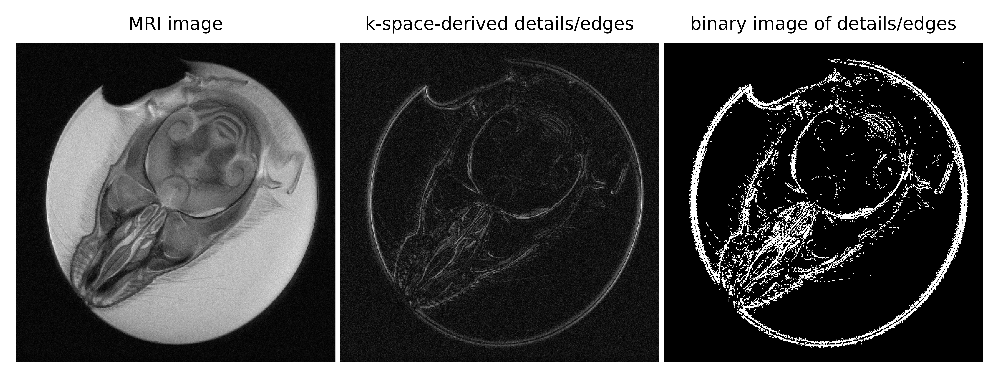

# MRI_k-space-derived_details_edges
k-space based details/edges detection in MRI images from Agilent FID data.

## The repository contains:
1. Python script kspace_det_edg.py.
2. [COMING SOON] PDF file presenting:
- short introduction to the topic,
- input parameters and their meanings,
- how the code works step by step,
- sample results with commentary.
3. Sample FID data in the sems_20190203_03.fid folder.
4. Sample results illustration in Figure1.png.

## License
The software is licensed under the MIT license. The non-software content of this project is licensed under the Creative Commons Attribution 4.0 International license. See the LICENSE file for license rights and limitations.
