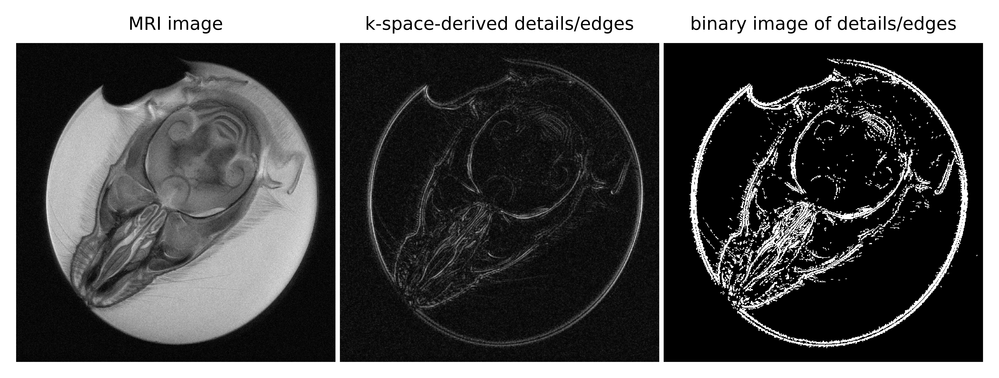
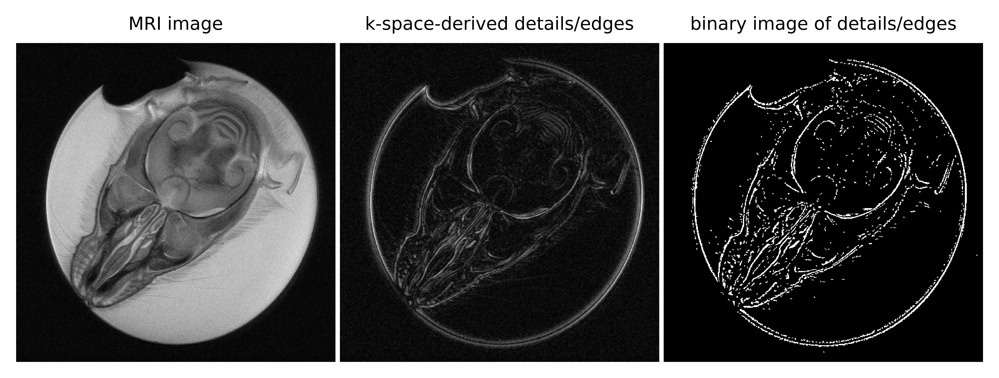

# MRI_k-space-derived_details_edges
k-space based details/edges detection in MRI images with optional k-space based denoising and detail control and three binarization methods to choose from (data import suitable for Agilent FID files). 

*
Figure A. Sample results for details/edges detection with detail control and simple thresholding.
*

*
Figure B. Sample results for details/edges detection with denoising, detail control and adaptive thresholding.
*

## The repository contains:
1. Python script kspace_det_edg.py.
2. [COMING SOON] PDF file presenting:
- short introduction to the topic,
- how the code works step by step,
- sample results with commentary.
3. Sample FID data in the sems_20190203_03.fid folder.
4. Sample results illustrations in FigureA.png and FigureB.png.

## References

1. Collection of the sample data:

Beata Wereszczyńska, *Alcohol-fixed specimens for high-contrast post-mortem MRI*, Forensic Imaging, Volume 25, 2021, 200449, ISSN 2666-2256, https://doi.org/10.1016/j.fri.2021.200449. (https://www.sciencedirect.com/science/article/pii/S2666225621000208)

2. Denoising:

Beata Wereszczyńska, *k-space weighting and masking for denoising of MRI image without blurring or losing contrast, as well as for brightening of the objects in the image with simultaneous noise reduction*, 2022, https://doi.org/10.5281/zenodo.7367057. (https://github.com/BeataWereszczynska/k-space_wght_msk_for_MRI_denoising)

3. Detail control:

Beata Wereszczyńska, *Graduate k-space masking for MRI image denoising and blurring*, 2022, https://doi.org/10.5281/zenodo.7359195. (https://github.com/BeataWereszczynska/k-space_masking_for_MRI_denoising)

## License
The software is licensed under the MIT license. The non-software content of this project is licensed under the Creative Commons Attribution 4.0 International license. See the LICENSE file for license rights and limitations.
